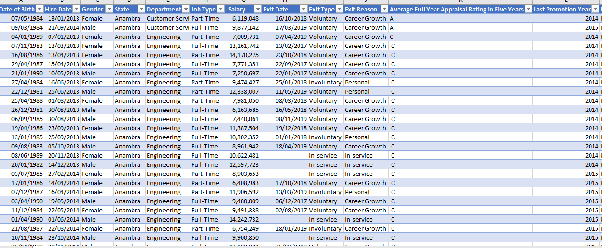
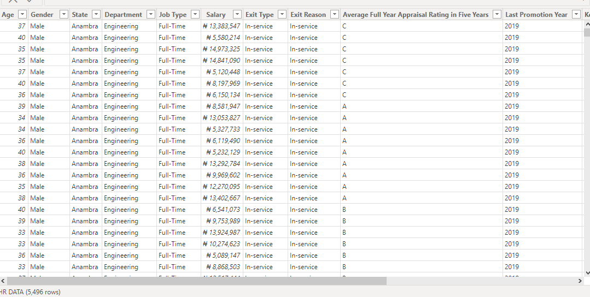
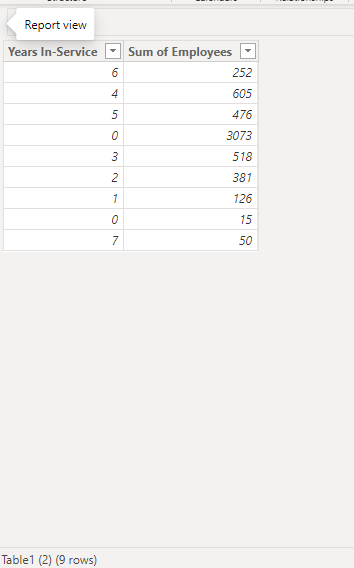
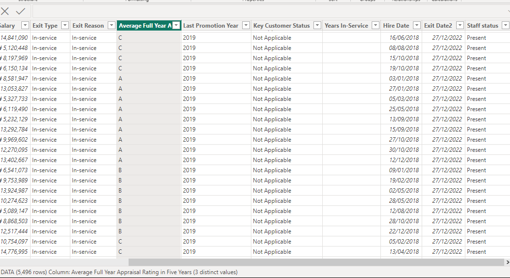
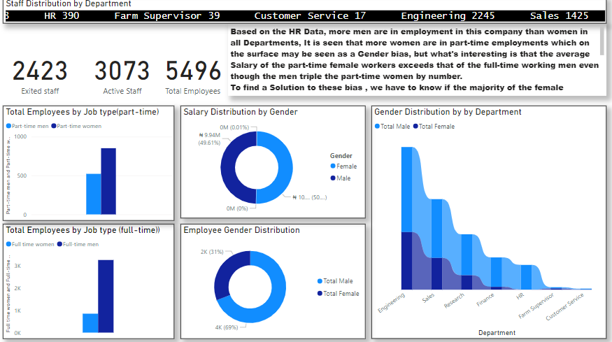
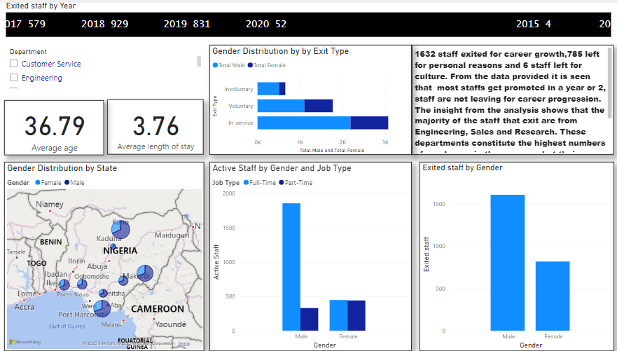
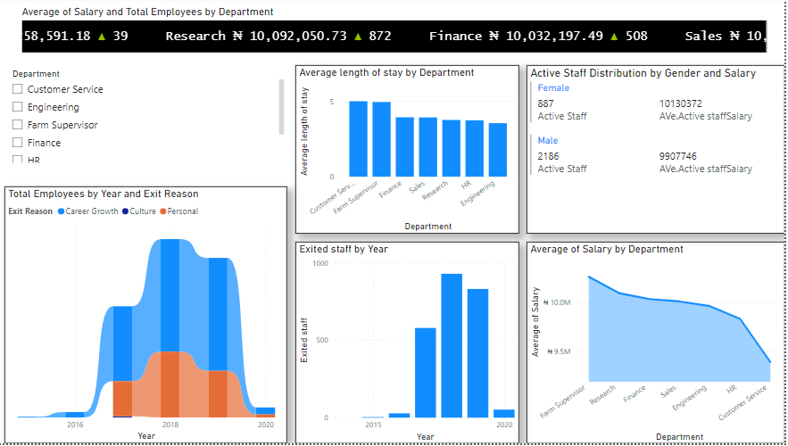

# StaffRetentionAnalyst

This project investigates the lack of staff retention in specific departments and gives practical recommendations to increase staff retention and workplace productivity in the Augustin group.

**Introduction:**

This document outlines the analysis conducted to address the issue of employee talent loss within The Augustin Group. The analysis aims to uncover the reasons behind the loss of professionals in certain departments and provide actionable recommendations to improve employee retention. By identifying and addressing the underlying issues, the company can enhance its workforce stability and overall organizational performance which in turn generates higher revenue for the organization.

**Problem Statement:**
The Augustin Group is currently grappling with the critical problem of losing valuable employee talent in specific departments. The inability to retain professionals adversely impacts the company's reputation and operational efficiency. Such cases of attrition may unveil deeper-rooted challenges including retaining underqualified employees, fostering a toxic work environment, promoting groupism, and hampering workplace productivity. If not tackled promptly, these problems could result in decreased morale, lower productivity, and hindered growth prospects.

*Data Sourcing:*
The data used for this analysis consists of two tables containing employee-related information, including length of service, gender, performance appraisals, job type, salary, department, and promotion dates. This data was collected from The Augustin Group's internal HR systems and covers a 7-year period (2015-2022).

*Skills Demonstrated:*
This project demonstrates several core skills in data analysis and problem-solving:

*Data Collection:* Gathering relevant HR data, including employee length of service, gender, performance appraisals, job type, salary, department, and promotion dates.

*Data Transformation:* Cleaning, structuring, and preparing raw data for analysis. The raw HR data underwent thorough transformation steps to prepare it for analysis. Data cleaning and preprocessing were performed to handle missing values, outliers, and inconsistencies. Categorical variables were encoded for numerical analysis, and relevant features were selected for investigation.

 

 

*Data Modeling:* Applying statistical and analytical techniques to uncover patterns and trends in the data.Merged the 2 tables to improve performance.

*Problem Identification:* Detecting and understanding the underlying reasons for talent loss.

*Recommendation Formulation:* Developing data-driven recommendations for management based on analysis outcomes.

*Descriptive Analysis:* Initial analysis involved calculating summary statistics such as attrition rates, average length of service, gender distribution, departmental breakdown and departmental distribution of talent loss.

  

*Exit Interview Analysis:*  analyze exit interview data for reasons cited by departing employees.

*Correlation Analysis:* Investigating correlations between factors like job satisfaction, compensation, career growth, and talent retention.         

*Attrition Analysis:* Studying attrition patterns, identifying departments with the highest talent loss, and understanding common factors leading to attrition.

*Root Cause Analysis:* Conduct in-depth investigations into the specific departments experiencing high talent loss to identify department-specific challenges.

*Correlation Analysis:* Investigating relationships between factors such as performance appraisals, salary, promotions, and employee retention.

**<ins>Recommendations:</ins>**

Based on the analysis, the following action steps are proposed

*1 Competitive Compensation :* Review and adjust compensation packages to ensure they are competitive within the industry, aiming to retain professionals.Based on the HR Data, more men are in employment in this company than women in all Departments, It is seen that more women are in part-time employments which on the surface may be seen as a Gender bias, but what's interesting is that the average Salary of the part-time female workers exceeds that of the full-time working men even though the men triple the part-time women by number.
To find a solution to these bias, we have to know if the majority of the female workers are agency or contract staff, if so the company can employ more full-time workers that are women, and invest in their training instead of paying so much for the part-time workers.The average age of the female in the company is 37, which MAY be a reason why their are not much full-time female in the company, could this be because of family life and kids? This has to be looked into, if the situation is true predicted then HR will need to hire females of a younger age bracket so that by the time they start having family life they're more balanced in their careers and are able to navigate both aspects without having to quit.

*2 Career Development:* 1632 staff exited for career growth,785 left for personal reasons, and 6 staff left for culture. From the data provided it is seen that  most staffs get promoted in a year or 2, staff are not leaving for career progression. The insight from the analysis shows that the majority of the staff that exit are from Engineering, Sales, and Research. These departments constitute the highest numbers of employees in the company but their Average Salary compared to the other departments is smaller, Staff in these departments are leaving because their income does not match their expertise,an interpretation of career growth by the employees in this context is tied to monetary compensation.

From the yearly progression of staff exit, the data shows that 2016 and 2020 were the years the exit number of staff was smallest, in 2016 the average salaries of Engineering, Sales and Research is higher when compared to 2017,2018,2019. In 2020 the average Salary increased but it's comparatively smaller than that of 2016.Only 52 staff exited the company in 2020 compared to almost a thousand exit in previous years.

**How can the company retain her professionals in Engineering, Sales, Research, and across the board?** 3 Minimize part-time staff across board as part-time staff earn more than full-time staff on average even-though the full -time staff double the part-time staff in number and increase the salary of full-time staff.

*4 Restructuring:* the company needs to do a salary and staff restructuring of Departments like farm supervisor  and customer service as they're small in number and they earn higher than other departments that are 10 times their size in number.

*5 Performance monitoring & Professional development:* The company can let go of Engineers, salespersons and researchers with C appraisal and employ younger less experienced staff and invest in their training if increasing  the salaries of Engineers & salespeople is not financially feasible.

**Other recommendations.**
*Regular Feedback Mechanisms:* Establish regular channels for employee feedback and address concerns proactively to improve overall job satisfaction.
*Retention Metrics Monitoring:* Continuously track retention metrics and conduct periodic reviews to assess the effectiveness of implemented measures.
Retention Strategy: Develop targeted retention strategies for departments experiencing high talent loss, focusing on factors such as career growth, competitive compensation, and work-life balance.
Performance Management: Strengthen performance appraisal systems to provide employees with clear feedback, goals, and opportunities for improvement.
Professional Development: Implement training and skill enhancement programs to help employees grow in their roles and advance within the company.
Transparent Promotions: Establish transparent promotion processes that reward merit and dedication, ensuring all employees have equal opportunities for career advancement.

In conclusion, addressing talent loss at The Augustin Group is vital to the company's success and growth. By using data-driven insights, the company can implement effective measures to improve employee retention, foster a healthier workplace environment, and achieve higher levels of productivity and organizational success.

